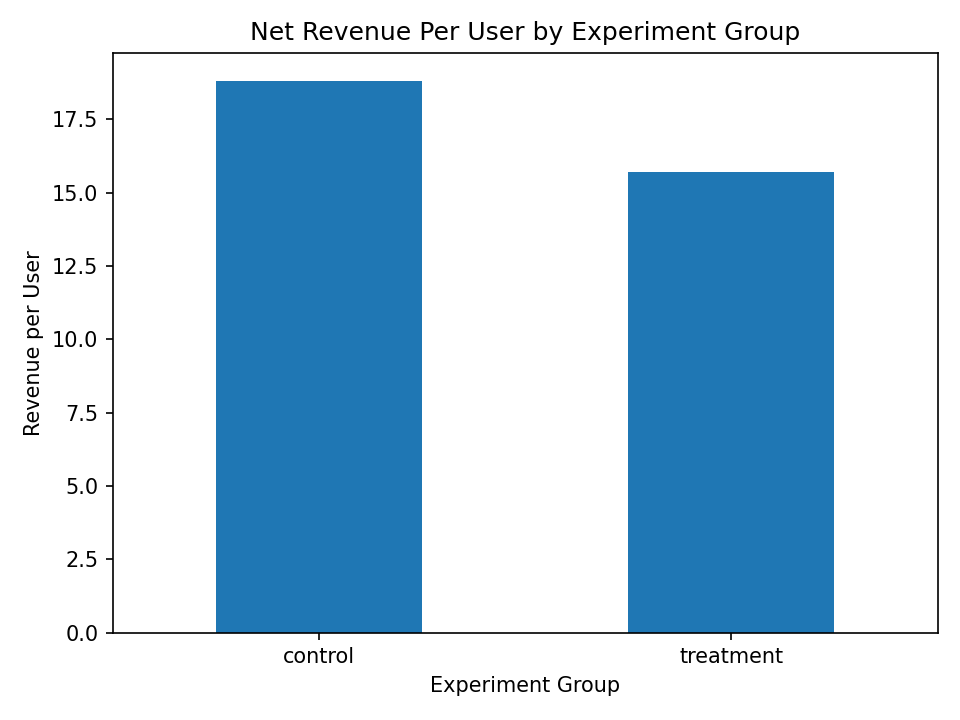
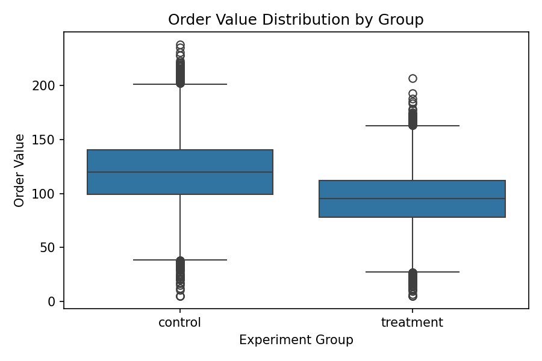
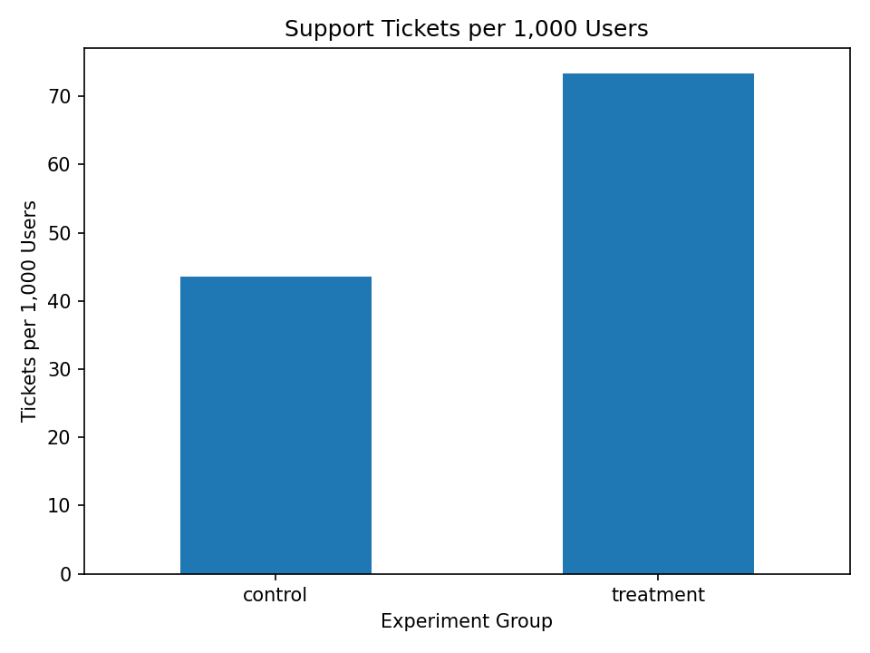

# 📊 A/B Testing Under Metric Tradeoffs: Revenue-Driven Product Decision
## 🚀 Executive Summary

A new landing page was tested to improve user conversion.
While surface-level metrics suggested little change, deeper analysis revealed a material decline in business value.

Conversion rate remained nearly flat

Average Order Value (AOV) dropped sharply

Customer support tickets increased

Using Net Revenue Per User (NRPU) as the primary decision metric, the experiment resulted in a ~16–17% revenue decline per user, which was both statistically reliable and practically significant.

Final Decision: Roll back the experiment.

## 🎯 Business Problem

Product teams frequently face experiments that show conflicting metrics. Optimizing for a single metric (e.g., conversion) can silently damage revenue or increase operational costs.

This project answers a realistic product question:

Should the company ship, partially roll out, or roll back a new landing page when conversion, revenue, and support metrics disagree?

## 🧠 Why These Metrics Matter (Critical Framing)

Not all metrics carry equal business weight.

### Conversion Rate
Indicates user action, but says nothing about transaction quality.

### Average Order Value (AOV)
Measures the quality of conversions and revenue per transaction.

### Net Revenue Per User (NRPU) (Primary Metric)
Combines conversion behavior and order value into a single measure of business impact.

### Support Tickets
Proxy for user friction and operational cost.

👉 Decisions are made on NRPU, not conversion alone.

## 📐 Hypotheses & Decision Framework
Primary Hypothesis (Business-Driven)

H₀ (Null Hypothesis):
The new landing page does not increase Net Revenue Per User (NRPU).

H₁ (Alternative Hypothesis):
The new landing page increases Net Revenue Per User (NRPU).

## Decision Rule

Ship only if NRPU increases meaningfully and confidence intervals exclude material revenue loss.

Conversion rate changes alone are insufficient to justify shipping.

Confidence intervals are preferred over point estimates to explicitly account for uncertainty.

## 🔬 Analytical Approach
### 1️⃣ Experiment Validation

Verified group balance and randomization

Removed contaminated observations where treatment exposure did not match assignment

Ensured causal interpretability before analysis

### 2️⃣ Exploratory Analysis (Before Testing)

Used EDA to surface early warning signals:

Group distribution

Conversion behavior

Order value distributions

Support ticket pressure

This prevents blind reliance on statistical tests.

### 3️⃣ Statistical Methodology

Descriptive statistics for diagnostic insight

Segmentation by new vs returning users

Bootstrap confidence intervals for NRPU
→ Chosen to assess uncertainty directly rather than rely on single p-values

Effect size interpretation to distinguish statistical vs practical significance

## 📈 Key Results (What Actually Happened)

| Metric                          | Control (Old Page) | Treatment (New Page) | Impact        | Business Interpretation                      |
| ------------------------------- | ------------------ | -------------------- | ------------- | -------------------------------------------- |
| **Conversion Rate**             | ~12.04%            | ~11.88%              | ↓ ~1.3%       | No meaningful improvement in user conversion |
| **Average Order Value (AOV)**   | ~119.8             | ~95.1                | ↓ ~20–21%     | Lower-value orders placed under treatment    |
| **Net Revenue Per User (NRPU)** | ~18.82             | ~15.70               | ↓ ~16–17%     | **Material revenue loss per user**           |
| **Support Ticket Rate**         | Lower              | Higher               | ↑ Significant | Increased user friction and operational cost |

Although conversion rate showed minimal change, the sharp decline in order value and increase in support tickets caused a substantial drop in net revenue per user, making the experiment economically unviable.

## Segmentation Findings

Revenue decline observed for both new and returning users

Support tickets increased across all segments

Partial rollout is not justified

Bootstrap confidence intervals for NRPU were non-overlapping, indicating the revenue decline is unlikely due to random variation.

## 📉 Visual Evidence (Decision Drivers)
Net Revenue Per User (Primary Metric)

Treatment reduces net revenue per user materially, making the experiment economically unviable.

Order Value Distribution

Lower-value orders explain why revenue declined despite similar conversion behavior.

Customer Support Ticket Rate

Increased user friction raises operational cost, compounding the revenue loss.

## 🔗 How Metric Tradeoffs Drove the Decision

Although conversion rate showed minimal change, the treatment attracted lower-quality orders and increased user friction. This combination reduced average order value and, when multiplied across users, caused a significant drop in net revenue per user.

The simultaneous rise in customer support tickets increased operational cost, sealing the rollback decision despite surface-level conversion stability.

## 🚫 Final Recommendation
Decision: Roll Back the Experiment

Shipping the new landing page would expose the business to:

Sustained revenue loss per user

Increased operational and support costs

Higher long-term churn risk

## Recommendation: Roll back the change and redesign the experience to address order-value dilution and user friction before re-testing.

## 📁 Repository Structure
AB-Testing-Metric-Tradeoffs/

├── README.md                         # Decision narrative (this file)

├── A-B-Testing_Final.ipynb           # Final, interview-ready analysis

├── ab_test_full_project_dataset.csv  # Dataset used for analysis

└── drafts/

└── A-B-Testing.ipynb             # Exploratory iteration

## 📊 Dataset Origin & Assumptions

This analysis is based on a **real A/B testing dataset** sourced from Kaggle:
- *E-commerce A/B Testing (2022 Dataset) : https://www.kaggle.com/datasets/putdejudomthai/ecommerce-ab-testing-2022-dataset1?utm_source=chatgpt.com*

The original dataset provides user-level experiment assignment and conversion behavior.  
However, it does not include **transaction value** or **operational cost signals**, which are critical for evaluating real business decisions.

To enable revenue- and cost-aware analysis:

- **Order Value (`order_value`)** was modeled using realistic assumptions conditioned on conversion behavior, reflecting typical e-commerce purchase distributions.
- **Customer Support Tickets (`support_ticket`)** were simulated as a proxy for user friction and operational cost, based on observed behavioral differences between experiment groups.

These derived fields were introduced **only to demonstrate analytical reasoning under metric tradeoffs**, not to claim real production outcomes.

The purpose of this project is to evaluate:
- how conflicting metrics interact,
- how business-aligned metrics (NRPU) change decisions,
- and how uncertainty should influence product rollouts,

rather than to reproduce exact real-world revenue figures.

## 💡 Why This Project Matters 

This project demonstrates:

Decision-making under conflicting metrics

Revenue-first analytical thinking

Explicit hypothesis framing and decision rules

Use of uncertainty (confidence intervals) over point estimates

Willingness to reject a feature based on evidence
